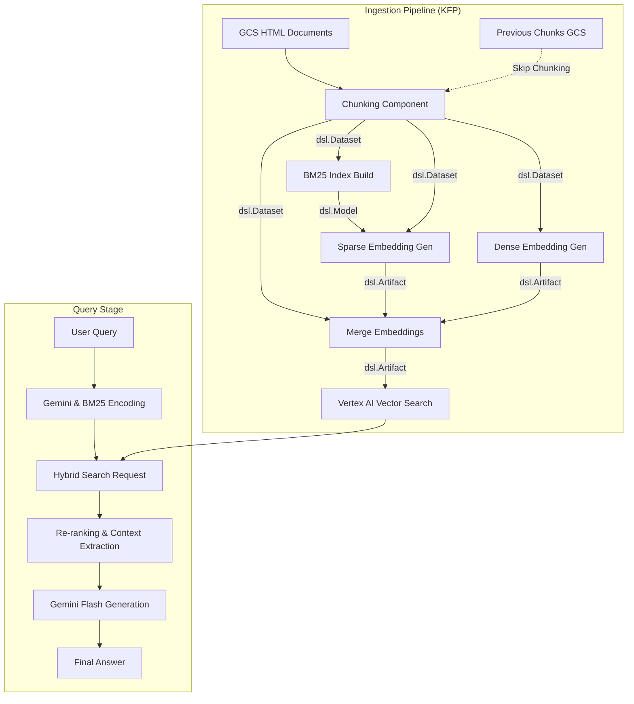

# RAG Ingestion with Vertex AI Pipelines

This repository contains an implementation for building a Retrieval-Augmented Generation (RAG) system using Google Cloud Vertex AI. It demonstrates how to scrape data, build a hybrid search index (Sparse BM25 + Dense Gemini Embeddings), and perform RAG queries.

## Architecture
The system implements a complex ingestion and retrieval architecture designed to handle hybrid search.



The workflow consists of four main logical stages:

1. **Data Collection** ([scrape/](scrape/)): Crawls a website (Bulbapedia) to gather raw HTML documents and stores them in Google Cloud Storage (GCS). Components are located in `scrape/components/`.
2. **Infrastructure** ([terraform/](terraform/)): Provisions the necessary Vertex AI Vector Search resources (Index and Endpoint) using Terraform.
3. **BM25 Index Generation** ([bm25_corpus_index/](bm25_corpus_index/)): A dedicated pipeline that scans the entire corpus to calculate global statistics (TF-IDF) and generates a BM25 index. Components are located in `bm25_corpus_index/components/`.
4. **Ingestion Pipelines** ([ingestion_pipeline/](ingestion_pipeline/)): Kubeflow Pipelines (KFP) for both full index regeneration and incremental updates. Components are located in `ingestion_pipeline/components/`.
5. **Query** ([query/](query/)): A sample application that performs hybrid search, re-ranks results, and generates answers using Gemini.

## Ingestion Pipelines

The system supports two primary ingestion workflows:

### 1. Full Index Regeneration (`full_pipeline.py`)
Used for a complete overhaul of the search index (e.g., when changing chunking strategies or embedding models).
* **Steps**: Chunking -> BM25 Build -> Embedding Generation -> **Full Index Overwrite**.
* **Impact**: Replaces all existing vectors in the Vertex AI index.

### 2. Incremental Update (`update_pipeline.py`)
Used for processing newly scraped data without rebuilding the entire corpus statistics.
* **Steps**: Chunking (new data only) -> Retrieve Existing BM25 -> Embedding Generation -> **Partial Index Update**.
* **Impact**: Appends new vectors to the existing Vertex AI index.

## Local Testing
You can test the ingestion components and pipeline logic locally without submitting a full Vertex AI Pipeline job. This is useful for rapid iteration on chunking or embedding logic.

```bash
cd ingestion_pipeline
# Install dependencies
pip install -r requirements.txt

# Run the local test harness
# This uses kfp.local to execute the pipeline logic on your machine
python test_pipeline_local.py \
    --pipeline update \
    --gcs-html-uri gs://YOUR_BUCKET/test-subset/html/ \
    --gcs-chunks-uri gs://YOUR_BUCKET/test-subset/chunks/ \
    --index-name YOUR_INDEX_DISPLAY_NAME \
    --project YOUR_PROJECT_ID
```

## Repository Structure
* `scrape/`: Scrapy spider. Components in `scrape/components/`.
* `terraform/`: Infrastructure as Code for Vertex AI resources.
* `bm25_corpus_index/`: BM25 training. Components in `bm25_corpus_index/components/`.
* `ingestion_pipeline/`: Unified pipelines. Components in `ingestion_pipeline/components/`.
* `chunk/`: Dedicated chunking logic. Components in `chunk/components/`.
* `query/`: RAG query and evaluation scripts.

## Prerequisites
* **Google Cloud Project**: With billing enabled.
* **APIs Enabled**: Vertex AI API, Cloud Storage API.

**Tools:**
* Python 3.11+
* Google Cloud SDK (gcloud)
* Terraform
* pip

## Getting Started
Follow these steps to set up the complete system.

### 1. Data Scraping
Navigate to the `scrape/` directory and run the spider to populate your GCS bucket with HTML files.

```bash
cd scrape
pip install -r requirements.txt
# Edit scrape_bulbapedia.py to set your GCS bucket name
python scrape_bulbapedia.py
```

### 2. Infrastructure Setup
Provision the Vector Search resources.

*Note: The deployment of the index to the endpoint can take approximately 30 minutes.*

```bash
cd terraform
# Update variables.tf or create a terraform.tfvars file with your project details
terraform init
terraform apply
```
Be sure to note down the `index_id` and `endpoint_id` output by Terraform.

### 3. Build BM25 Index
Train the BM25 encoder on your scraped data. This establishes the "Global Statistics" required for sparse embedding.

```bash
cd bm25_corpus_index
pip install -r requirements.txt
# Submit the training job to Vertex AI Pipelines
python submit_pipeline.py --project-id YOUR_PROJECT_ID --gcs-uri gs://YOUR_BUCKET/pokemon/bulbapedia/html
```

### 4. Run Ingestion Pipeline
Process the documents and populate the Vector Search Index. This step converts HTML to Markdown, chunks specifically by header and character count, and merges sparse/dense vectors.

```bash
cd ingestion_pipeline
pip install -r requirements.txt
# Submit the ingestion job
python submit_pipeline.py \
    --project YOUR_PROJECT_ID \
    --gcs-input-uri gs://YOUR_BUCKET/pokemon/bulbapedia/html \
    --index-name YOUR_INDEX_Resource_Name
```

### 5. Querying
Perform a RAG query to test the system.

```bash
cd query
pip install -r requirements.txt
# Update main.py with your Project ID, Index Endpoint ID, and Deployed Index ID
python main.py
```

## Future Roadmap & Advanced RAG
The following features are being considered for future iterations of this pipeline:

* **PDF & Image Support**: Using models like ColPali to encode PDF pages as image patches for better retrieval of complex documents.
* **Late Interaction Models**: Investigating ColBERT for improved recall.
* **Agentic RAG**: Adding "Agentic Memory" to utilize context from past conversations.
* **Smart Query Rewriting**: Automatically rewriting unclear user questions before retrieval.
* **Re-ranking**: Implementing a Cross-Encoder to filter unrelated chunks before the generation step.

## Key Technologies
* **Google Cloud Vertex AI**: Vector Search (Hybrid), Pipelines, and Gemini Models.
* **Kubeflow Pipelines (KFP)**: Orchestration of ML workflows.
* **Sparse Embedding**: BM25 / SPLADE.
* **Dense Embedding**: Gemini-embedding-001 / BERT.
* **Langchain**: Used for MarkdownHeaderTextSplitter and RecursiveCharacterTextSplitter.
* **Terraform**: Infrastructure as Code.